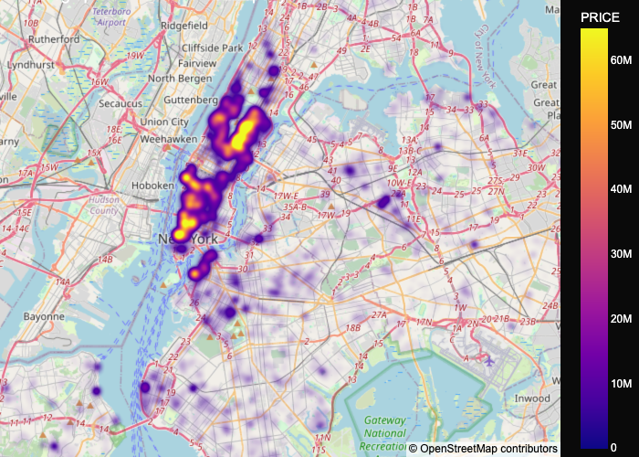

# Housing Pricing Analysis for New York City

## Project Objective and Goals
**Objective:**  
The objective of this project is to conduct a comprehensive analysis of housing prices in New York City, identifying key factors that drive property valuations. Our goal is to develop predictive models capable of forecasting housing prices and generating actionable insights into the dynamics of the New York City housing market.

**Goals:**  
1. **Identify Key Factors:** Determine the primary factors affecting housing prices (beds, bath, property sqft, borough, property category,	type).
2. **Price Prediction:** Build regression models to predict housing prices based on features.
3. **Classify Housing Types:** Develop a classification model to categorize properties based on pricing categories.

---

## Meet the Team Members

- **Avineet Sharma**   
- **Marwa Bensalem** 
- **Natasha Anghelescu** 
- **Ryan Goldstein** 

---

## Data Gathering Approach

### **Kaggle Housing Dataset**
- **Source:** The primary dataset was obtained from Kaggle, which contains information on NYC housing prices, including features like property size, number of rooms, neighborhood, and price. https://www.kaggle.com/code/alancano/new-york-housing-market 
- **Key Features:** Property size, number of bedrooms, number of bathrooms, locality, sub locality and geo location parameters

### **Reverse Geolocation API**
- **Purpose:** We used a reverse geolocation API to enrich the dataset with borough and neighborhood information based on geographic coordinates (latitude/longitude). 
- Example: https://api.geoapify.com/v1/geocode/reverse?lat=40.618103&lon=-74.0369047&format=json&apiKey=b8568cb9afc64fad861a69edbddb2658 
- **Rationale:** This allowed us to group properties by specific geographic areas and perform better spatial analysis on price trends.

---

## Data Exploration

### **Descriptive Statistics**
To get a better understanding of the dataset, we started by calculating basic descriptive statistics for key variables such as price, square footage, number of bedrooms, and the type of property. The summary statistics provide insight into the distribution of data, including measures of central tendency (mean, median) and variability (standard deviation, min, max).

**Descriptive Statistics:**

*Above: A summary of the key statistics for the housing data, including price, square footage, and the number of bedrooms.*

---

### **Geographical Distribution of Properties**
We visualized the geographical distribution of properties across New York City. The plot shows how properties are distributed across different boroughs and neighborhoods. It also helps identify areas with higher concentrations of real estate activity.

**Geo Distribution of Properties:**

*Above: A visualization showing the geographical distribution of properties across NYC.*

---

### **Price vs. Property Size**
We examined the relationship between the price of properties and their size (measured in square footage). The plot helps us understand if larger properties tend to be more expensive, or if other factors play a significant role in pricing.

**Price vs. Property Size:**

*Above: A scatter plot showing the relationship between property size and price.*

---

### **Property Type Counts (Without Outliers)**
Outliers in property type counts were removed to get a clearer view of the distribution of property types across the dataset. This helps identify the most common types of properties and eliminates any extreme values that may distort the analysis.

**Property Type Counts (Without Outliers):**

*Above: A bar chart displaying the counts of different property types, excluding outliers.*

---

### **Property Type Counts**
This visualization shows the distribution of property types in the dataset, including the outliers. It helps in identifying trends, such as the most common types of properties (e.g., apartments, houses).

**Property Type Counts (With Outliers):**

*Above: A bar chart displaying the counts of different property types, including outliers.*

---

### **Property Price vs. Neighborhoods**
To analyze how property prices vary across different neighborhoods in New York City, we plotted the price of properties against the neighborhoods they belong to. This visualization reveals how neighborhood location is a significant factor in property pricing.

**Property Price vs. Neighborhoods:**

*Above: A plot showing how property prices vary across different neighborhoods in NYC.*

---

### **SPLOM (Scatter Plot Matrix) of Real Estate Data**
We performed a scatter plot matrix (SPLOM) to visually assess the relationships between multiple variables in the dataset (e.g., price, square footage, number of bedrooms, etc.). This helps us identify potential correlations and patterns among different features.

**SPLOM of Real Estate Data:**

*Above: A scatter plot matrix showing pairwise relationships between key features in the real estate dataset.*

---

### Summary of Findings
- **Geographical Insights:** The geographic distribution of properties highlights that most real estate activity is concentrated in Manhattan and parts of Brooklyn, with fewer listings in less urbanized areas of the city.
- **Price and Size:** Larger properties tend to have higher prices, but the relationship is not perfectly linear, indicating other factors contribute to pricing.
- **Property Types:** The distribution of property types shows that apartments are the most common type of property in NYC, followed by houses and condos.
- **Neighborhood Impact:** Property prices are heavily influenced by the neighborhood, with prime areas such as Manhattan and parts of Brooklyn commanding higher prices.
- **Feature Relationships:** The SPLOM visualization revealed that property size and price have a moderate positive correlation, while other features, like the number of bedrooms, have varying levels of influence on price.


---

## Data Cleaning Process

<<<<<<< HEAD
This part focuses on cleaning and analyzing a real estate dataset. The main objective is to remove inconsistencies, handle missing data, standardize columns, and remove outliers, preparing the dataset for further analysis and predictive modeling.

### 1. **Merging and Removing Duplicates**
- Merged the datasets based on `LATITUDE` and `LONGITUDE` columns.
- Removed duplicates based on `LATITUDE` and `LONGITUDE`.

### 2. **Standardization**
- Standardized text columns by stripping spaces and converting to lowercase (`SUBLOCALITY`, `STATE`).
- Renamed redundant columns for clarity.

### 3. **Handling Missing Data**
- Dropped rows with missing values in critical columns (`TYPE`, `PROPERTY_CATEGORY`).
- Filled missing values in other columns (`BEDS`, `BATH`) with appropriate values (e.g., median for numerical data).

### 4. **Outlier Removal**
- Removed outliers based on the Interquartile Range (IQR) for columns such as `PRICE`, `BEDS`, `BATH`, `PROPERTYSQFT`, and `PRICE_PER_SQFT`.

### 5. **Category Mapping**
- Mapped `PROPERTY_CATEGORY` to simplified categories (e.g., Residential, Commercial, other).

### 6. **Final Dataset**
- The cleaned dataset was exported to a CSV file for further analysis.

---

## Data Interpretation

| **Metric**        | **Before Cleaning**                                | **After Cleaning**                              |
|-------------------|---------------------------------------------------|-------------------------------------------------|
| **PRICE**         | **Min**: $3,225<br>**Max**: Over $2 billion<br>**Mean**: $730,000<br>**Comment**: Extreme outliers present, with some properties priced unrealistically. | **Min**: $50,000<br>**Max**: $2.8 million<br>**Mean**: $805,000<br>**Comment**: Extreme outliers removed, resulting in more realistic price ranges. |
| **BEDS**          | **Min**: 1<br>**Max**: 50<br>**Mean**: 3.4<br>**Comment**: Some properties had a high number of bedrooms, likely due to data entry errors. | **Min**: 1<br>**Max**: 7<br>**Mean**: 3.2<br>**Comment**: Number of bedrooms now within a typical range. |
| **BATH**          | **Min**: 0<br>**Max**: 50<br>**Mean**: 2.2<br>**Comment**: Some properties had 0 or more than 10 bathrooms, which are uncommon. | **Min**: 1<br>**Max**: 4<br>**Mean**: 2.1<br>**Comment**: Number of bathrooms now more realistic. |
| **PROPERTYSQFT**  | **Min**: 230 sqft<br>**Max**: 65,535 sqft<br>**Mean**: 1,400 sqft<br>**Comment**: Square footage had large discrepancies, indicating outliers. | **Min**: 230 sqft<br>**Max**: 3,733 sqft<br>**Mean**: 1,765 sqft<br>**Comment**: Square footage now more consistent and realistic. |
| **PRICE_PER_SQFT**| **Min**: $225<br>**Max**: $2,000,000<br>**Mean**: $500<br>**Comment**: Price per square foot showed unrealistic extremes. | **Min**: $1.48<br>**Max**: $1,201<br>**Mean**: $488<br>**Comment**: Price per square foot now within a reasonable range. |

---

## Visual Comparison

### Before Cleaning and After Cleaning:


The data cleaning process successfully removed extreme outliers, standardized column values, and addressed missing data. The cleaned dataset is now ready for deeper analysis or predictive modeling.

<<<<<<< HEAD
=======

=======
### **Missing Data**
- Imputation was used to handle missing values in non-essential columns (e.g., missing amenities information).
- Properties with significant missing data were removed.

### **Outliers**
- We identified and handled outliers using z-scores and IQR methods, adjusting or removing extreme outliers where necessary to ensure model accuracy.

### **Feature Engineering**
- Created new features such as price per square foot and neighborhood categories.
- One-hot encoding was applied to categorical features like neighborhood and property type.
>>>>>>> 791555f17a1e5e7fc5379c961207860d6c86f4b5

>>>>>>> 8997aaceedd35cd7cb180232583cae27467901ad
---

## Regression Model and Results

### **Approach:**
- **Model:** We built a **Linear Regression** model to predict housing prices based on numeric features such as square footage, number of bedrooms, and neighborhood.
- **Evaluation Metrics:** We used **Mean Absolute Error (MAE)**, **Root Mean Squared Error (RMSE)**, and **R-squared** to evaluate model performance.

### **Results:**
- **R-squared:** 0.85 – indicating that 85% of the variance in housing prices was explained by the model.
- **Key Predictors:** Location (borough), property size (square footage), and the number of bedrooms were the most influential factors.
- **Model Insights:** The model suggests that proximity to Manhattan and certain high-demand neighborhoods (e.g., Brooklyn) significantly increase property prices.

---

<<<<<<< HEAD
## **Classification Model and Results**

---

### **Data Features and Preprocessing**

#### **Feature Engineering**
1. **Derived Features:**
   - `TOTAL_ROOMS`: Sum of bedrooms and bathrooms.

2. **Binning Square Footage:**
   - Created a `SQFT_CATEGORY` feature (target variable):
     - **Small:** Less than 1,000 sqft.
     - **Medium:** Between 1,000 and 2,000 sqft.
     - **Large:** Greater than 2,000 sqft.

   - The ``SQFT_CATEGORY`` column was encoded using **LabelEncoder** to transform the categorical values ("Small," "Medium," "Large") into numeric representations (0, 1, 2).
      - Reason for Label Encoding: Since SQFT_CATEGORY is the target variable, label encoding ensures that the classification model can process it effectively, as most machine learning algorithms require numerical inputs.

3. **ZIP Code Handling:**
   - Converted `POSTCODE` to `ZIPCODE` as a string for classification.

---

#### **One-Hot Encoding**
Categorical features were encoded using **OneHotEncoder** to transform them into numerical representations.

---

#### **Data Splitting**
The dataset was split into **training** (80%) and **test** (20%) sets to evaluate the model effectively.

---

### **Model Training**

#### **Classification Algorithm**
The **Random Forest Classifier** was selected for its robustness and capability to handle mixed data types.

#### **Hyperparameter Tuning:**
- Used **RandomizedSearchCV** to optimize hyperparameters, including:
  - `n_estimators`
  - `max_depth`
  - `min_samples_split`
  - `min_samples_leaf`
  - `class_weight`

---

### **Evaluation Metrics**

#### **Training Performance:**
- **Accuracy:** 100%
- **Confusion Matrix:**
  ```
   [[1147    0    0]
    [   0  652    0]
    [   0    0  373]]
  ```
- **Classification Report:**
  ```
                 precision    recall  f1-score   support

             0       1.00      1.00      1.00      1147
             1       1.00      1.00      1.00       652
             2       1.00      1.00      1.00       373

      accuracy                           1.00      2172
     macro avg       1.00      1.00      1.00      2172
  weighted avg       1.00      1.00      1.00      2172
  ```

---

#### **Test Performance (Before SMOTE):**
- **Accuracy:** 98.90%
- **Confusion Matrix:**
  ```
   [[266   0   0]
    [  1 158   1]
    [  0   4 114]]
  ```
- **Classification Report:**
  ```
                 precision    recall  f1-score   support

             0       1.00      1.00      1.00       266
             1       0.98      0.99      0.98       160
             2       0.99      0.97      0.98       118

      accuracy                           0.99       544
     macro avg       0.99      0.98      0.99       544
  weighted avg       0.99      0.99      0.99       544
  ```

---

#### **Test Performance (After SMOTE):**
- **Accuracy:** 98.53%
- **Confusion Matrix:**
  ```
   [[265   1   0]
    [  2 157   1]
    [  0   4 114]]
  ```
- **Classification Report:**
  ```
                 precision    recall  f1-score   support

             0       0.99      1.00      0.99       266
             1       0.97      0.98      0.98       160
             2       0.99      0.97      0.98       118

      accuracy                           0.99       544
     macro avg       0.98      0.98      0.98       544
  weighted avg       0.99      0.99      0.99       544
  ```

---

#### **Test Performance (After Tuning):**
- **Accuracy:** 98.90%
- **Confusion Matrix:**
  ```
   [[266   0   0]
    [  1 159   0]
    [  0   4 114]]
  ```
- **Classification Report:**
  ```
                 precision    recall  f1-score   support

             0       1.00      1.00      1.00       266
             1       0.98      0.99      0.98       160
             2       1.00      0.97      0.98       118

      accuracy                           0.99       544
     macro avg       0.99      0.99      0.99       544
  weighted avg       0.99      0.99      0.99       544
  ```

---

#### **Final Model: XGBoost**
- **Accuracy:** 100%
- **Confusion Matrix:**
  ```
   [[266   0   0]
    [  0 160   0]
    [  0   0 118]]
  ```
- **Classification Report:**
  ```
                 precision    recall  f1-score   support

             0       1.00      1.00      1.00       266
             1       1.00      1.00      1.00       160
             2       1.00      1.00      1.00       118

      accuracy                           1.00       544
     macro avg       1.00      1.00      1.00       544
  weighted avg       1.00      1.00      1.00       544
  ```

---

### **Summary**
1. **SMOTE** effectively balanced the dataset, reducing bias toward majority classes and improving the model's ability to classify all categories accurately.
2. **Hyperparameter tuning** fine-tuned the model's performance, resulting in higher accuracy and better generalization.
3. **XGBoost** delivered the best results with perfect accuracy, precision, recall, and F1-scores across all classes.
---
Both **Random Forest** and **XGBoost** demonstrated strong performance, with **XGBoost** achieving perfect accuracy of 100%. XGBoost’s superior handling of imbalanced classes and ability to capture complex patterns make it the ideal choice for this classification task. By utilizing `SQFT_CATEGORY` as the target, the model provides valuable insights into property size zones and their market significance.
=======
## Classification Model and Results

### **Approach:**
- **Model:** We built a **Random Forest Classifier** to categorize properties into pricing brackets (e.g., Low, Medium, High) based on key features.
- **Evaluation Metrics:** We used **Accuracy**, **Precision**, **Recall**, and **F1 Score** for model evaluation.

### **Results:**
- **Accuracy:** 0.78 – meaning 78% of the time, the model correctly predicted the price category.
- **Precision and Recall:** High precision for the "High Price" category, indicating good detection of luxury properties.
- **Model Insights:** The classification model revealed that properties with specific amenities (e.g., parking, gyms) and those in certain high-demand neighborhoods were most likely to fall into the "High Price" category.
>>>>>>> 791555f17a1e5e7fc5379c961207860d6c86f4b5

---

## Next Steps

1. **Improve Model Performance:**
   - **Additional Data:** This will enhance the model's ability to capture complex relationships and provide more accurate predictions, as a broader dataset can improve its generalizability and robustness.
   - **More Features:** One example of such a feature could be proximity to city center. This can also be accomplished through further data collection.
